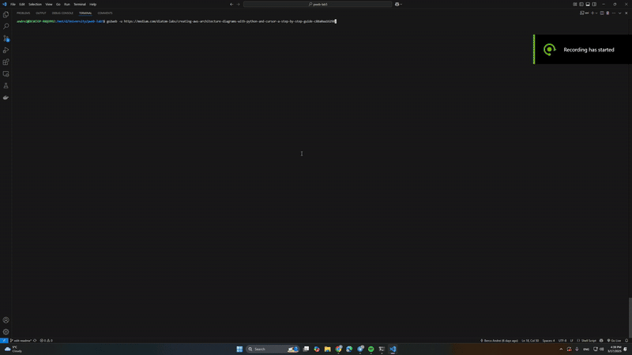

# go2web

A command-line web client that allows you to make HTTP requests, search the web, and view content in a human-readable format without relying on external HTTP libraries.



## Features

- Make HTTP requests to any URL
- Search the web with DuckDuckGo
- Access search results directly through the CLI
- Follow HTTP redirects automatically
- Cache HTTP responses for faster repeated access
- Content negotiation (JSON/HTML)
- Human-readable output formatting

## Installation

Clone the repository and run the installation script:

```bash
git clone <https://github.com/KaBoomKaBoom/pweb-lab5.git>
cd pweb-lab5
sudo apt-get install dos2unix   # Install if you don't have it
dos2unix install.sh             # Convert the file
dos2unix go2web
./install.sh
```

The installation script will:
1. Make the `go2web` script executable
2. Create a symbolic link in `/usr/local/bin` to make the command available system-wide

## Usage

### Basic Commands

```bash
go2web -u <URL>         # Make an HTTP request to the specified URL
go2web -s <search-term> # Search using DuckDuckGo and print top 10 results
go2web --link <number>  # Access a link from previous search results
go2web -h               # Show help information
```

### Examples

#### Making a Simple HTTP Request

```bash
go2web -u https://example.com
```

This will fetch the webpage, strip away HTML tags, and present the content in a readable format.

#### Searching the Web

```bash
go2web -s "python tutorial"
```

This will search DuckDuckGo for "python tutorial" and display the top 10 results.

#### Accessing Search Results

After performing a search, you can directly access any of the results:

```bash
go2web --link 3
```

This will open the third link from your previous search results.

## How It Works

### HTTP Client Implementation

The tool implements HTTP requests from scratch using socket connections, supporting both HTTP and HTTPS. It handles:

- Request headers and methods
- Response parsing
- Content encoding (gzip, deflate)
- Character encoding
- Redirects

### Caching Mechanism

The tool implements a simple file-based caching system:

- Responses are cached locally in `.go2web_cache`
- Cache entries expire after 1 hour by default
- Content type-specific caching

### Search Engine Integration

The tool interfaces with DuckDuckGo's HTML search interface and parses the results to extract:

- Result titles
- URLs
- Up to 10 results per search

### Content Processing

The tool processes different content types:

- HTML is parsed and stripped to show only relevant text and links
- JSON is formatted with proper indentation for readability

## Dependencies

- Python 3.x
- BeautifulSoup4 (for HTML parsing)
- Standard Python libraries (socket, ssl, json, etc.)

## Limitations

- Only supports GET method for HTTP requests
- Search functionality is limited to DuckDuckGo
- Basic content negotiation (HTML/JSON)

